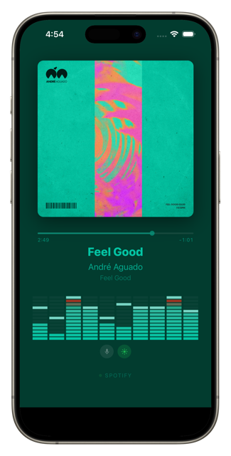
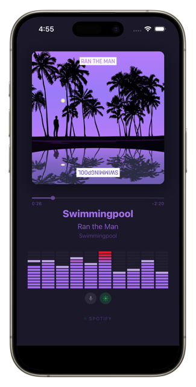
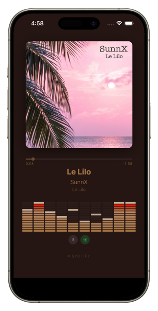

# TuneBoss

A real-time **now playing** display for Spotify, designed to turn an iPhone into a dedicated always-on music screen.

<p align="center">
  &nbsp;&nbsp;
  &nbsp;&nbsp;
  
</p>

TuneBoss polls the Spotify Web API and pushes track updates over WebSocket to a Vue 3 PWA. The display renders album art, track metadata, a progress bar, and a 10-band spectrum analyzer — all with dynamic color theming extracted from the cover art.

## Features

- **Album art with dynamic theming** — colors extracted from cover art using node-vibrant; background, text, and spectrum bars adapt to every track
- **10-band spectrum analyzer** — procedural 60 fps visuals seeded from the Spotify track ID, giving each song a unique visual personality
- **Microphone mode** — optional real-time FFT spectrum from the device mic with automatic music detection and crossfade blending
- **Track progress bar** — interpolated between 3-second server polls for smooth visual continuity
- **Progressive Web App** — fullscreen, portrait-locked, with screen wake lock to stay on indefinitely
- **Client-gated polling** — Spotify API is only polled while a client is connected, preserving rate limit budget
- **Token persistence** — OAuth tokens survive server restarts without re-authentication
- **Docker-ready** — single-container local mode or multi-container homelab deployment with Caddy and automatic HTTPS

## How It Works

```
iPhone (Safari PWA)  ◄──── Socket.io ────►  Node.js (Express)
                                                  │
                                            Spotify Web API
                                          (poll every 3 seconds)
```

The Node.js backend handles all Spotify OAuth credentials and API communication. The iPhone is a stateless display client — it receives data exclusively through Socket.io and never talks to Spotify directly.

### Spectrum Visualization

Since Spotify deprecated the `/audio-analysis` endpoint in November 2024, TuneBoss generates its own visuals. Each track ID is hashed to seed a PRNG that derives a unique BPM (90–150 range) and per-band oscillator shapes. The result is deterministic — the same song always produces the same visualization.

For higher fidelity, the optional microphone mode captures ambient audio through the Web Audio API, maps FFT data to 10 logarithmic frequency bands, and crossfades smoothly between procedural and real-time spectrum data when music is detected.

## Installation

See **[INSTALL.md](INSTALL.md)** for setup instructions covering Docker, homelab, and bare-metal deployments.

## Prerequisites

Before installing, you'll need a **Spotify Developer App**:

1. Go to the [Spotify Developer Dashboard](https://developer.spotify.com/dashboard)
2. Click **Create App**
3. Set the **Redirect URI** to match your deployment (e.g., `http://localhost:3000/auth/spotify/callback`)
4. Select **Web API** under "Which APIs are you planning to use?"
5. Note your **Client ID** and **Client Secret**

> Your app starts in development mode, limited to 25 users. For personal use, add your Spotify account under **User Management** in the dashboard.

## Usage

1. Open TuneBoss in a browser and click **Connect Spotify** to authenticate
2. Play music on any Spotify client logged into the same account
3. The display updates in real time

### iPhone Setup (PWA)

1. Open `http://<server-ip>:3000` in Safari
2. Tap **Share** → **Add to Home Screen**
3. Launch from the home screen for fullscreen mode

> **Tip**: Enable **Guided Access** (Settings → Accessibility → Guided Access) to lock the iPhone into TuneBoss and prevent accidental navigation.

## Architecture

```
client/
├── src/
│   ├── App.vue                    # Root state, Socket.io, theming
│   ├── components/
│   │   ├── NowPlaying.vue         # Layout container
│   │   ├── AlbumArt.vue           # Cover art + color extraction
│   │   ├── TrackInfo.vue          # Title / artist / album
│   │   ├── TrackProgress.vue      # Progress bar + timestamps
│   │   └── SpectrumAnalyzer.vue   # Canvas renderer (60 fps)
│   └── composables/
│       ├── useAudioAnalysis.js    # Procedural spectrum from track ID
│       ├── useMicrophoneAnalyzer.js  # Real-time FFT from mic
│       └── useWakeLock.js         # Screen wake lock (native + video fallback)

server/
├── index.js                       # Express + Socket.io entry point
├── aggregator.js                  # Event hub, client-gated polling
├── auth/
│   └── spotify.js                 # OAuth 2.0 (auth code flow)
└── providers/
    └── spotify.js                 # Spotify API polling
```

For a deep dive into the design, see [DESIGN.md](DESIGN.md).

## Tech Stack

| Layer    | Technology                          |
|----------|-------------------------------------|
| Backend  | Node.js, Express, Socket.io         |
| Frontend | Vue 3, Vite, Canvas API             |
| Realtime | Socket.io (WebSocket)               |
| Theming  | node-vibrant (color extraction)     |
| Deploy   | Docker, Caddy (HTTPS reverse proxy) |

## Contributing

Contributions are welcome. Please open an issue to discuss your idea before submitting a pull request.

## License

[MIT](LICENSE)
